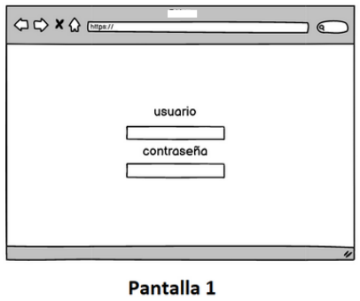
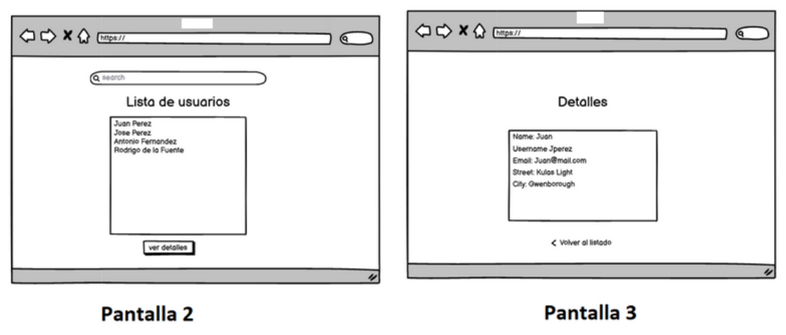

# Test
Usuario: holamundo
Contraseña: cool

El objetivo de esta prueba es medir competencias importantes en el manejo de esta
herramienta incluyendo los siguientes puntos:
1. ES6.
2. React JS
3. Conocimiento CSS.
4. Conocimiento en construcción de interfaces.
5. Git.
6. npm o yarn

# 

Ejercicio Número 1:
El Objetivo de este ejercicio es crear una interfaz parecida a los siguientes wireframes

#

Ejercicio Número 2:
En este ejercicio vamos a dar un poco de funcionalidad a la interfaz creada en el ejercicio
anterior:
● La idea es que la pantalla de inicio de sesión (Pantalla 1) te permita llegar a la lista
de usuarios utilizando el botón (no es necesario que la web app se encuentre
conectada a una base de datos).
● Para el listado de usuarios (Pantalla 2) puedes consumir la siguiente REST API:
https://jsonplaceholder.typicode.com/users o crear tu propia lista “mock”.
● Por último al hacer click en el nombre de un usuario desplegar una nueva pantalla
con el detalle del usuario seleccionado (Pantalla 3).

#

Ejercicio Número 3:
Para completar la prueba sube tu codigo a algun repositorio (GitHub, Bitbucket, etc...)